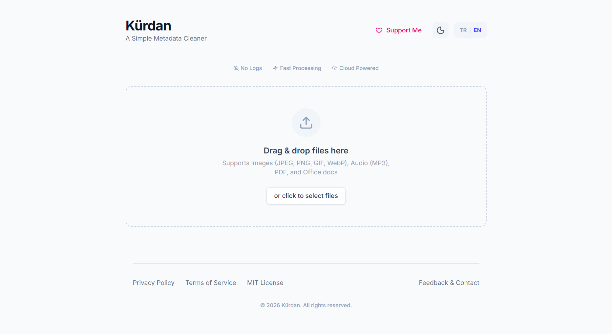

# Kürdan - Simple Metadata Cleaner

Kürdan is a privacy-focused web application that removes hidden metadata from your files. When you share photos, documents, or audio files, they often contain sensitive information like GPS coordinates, author names, or device details. Kürdan strips this data while preserving file quality.



## Features

- **Drag & Drop Interface**: Upload files by dragging them into the browser or using Ctrl+V to paste.
- **Batch Processing**: Clean multiple files at once and download them individually or as a ZIP archive.
- **Metadata Preview**: See what hidden data exists in your files before cleaning.
- **Dark Mode**: Full dark theme support for comfortable use.
- **Mobile Ready**: Responsive design works on phones and tablets.

## Supported File Types

| Category | Formats | What Gets Removed |
|----------|---------|-------------------|
| **Images** | JPEG, PNG, WebP, GIF, HEIC, AVIF, TIFF | EXIF, XMP, GPS, ICC Profiles |
| **Audio** | MP3, WAV, OGG, M4A, FLAC | ID3v1/v2 tags, cover art |
| **Documents** | PDF | Author, Producer, Keywords, Timestamps |
| **Office** | DOCX, XLSX, PPTX, ODS, ODT, ODP | Creator, Company, Last Modified By |

## Privacy & Security

Kürdan is built with a strict **No-Logs Policy**:

- Files are processed in memory and deleted immediately after download
- No file names, content, or user data is ever logged
- Automatic cleanup runs every 30 minutes as a failsafe
- Only an anonymous global counter (total files cleaned) is tracked

Server security includes rate limiting, CORS protection, MIME type validation, path traversal prevention, and security headers via Helmet.

## Getting Started

### Requirements

- Node.js v18 or higher
- npm

### Installation

```bash
# Clone the repository
git clone https://github.com/yourusername/Kurdan.git
cd Kurdan

# Install frontend dependencies
npm install

# Install backend dependencies
cd server
npm install
```

### Running the Application

You need two terminal windows:

**Terminal 1 - Backend Server:**
```bash
cd server
npm start
```

**Terminal 2 - Frontend:**
```bash
npm run dev
```

Open your browser and go to `http://localhost:5173`

### Environment Configuration

Create a `.env` file in the `server` directory (optional):

| Variable | Default | Description |
|----------|---------|-------------|
| `PORT` | `3000` | Backend server port |
| `ALLOWED_ORIGINS` | `http://localhost:5173` | Allowed CORS origins (comma-separated) |
| `NODE_ENV` | `development` | Set to `production` for deployment |
| `BEHIND_PROXY` | `false` | Set to `true` if behind nginx/Cloudflare |

## Tech Stack

**Frontend:** React 19, Vite, Tailwind CSS, i18next, Framer Motion  
**Backend:** Node.js, Express 5, Sharp, pdf-lib, node-id3, JSZip  
**Security:** Helmet, express-rate-limit, file-type (magic byte validation)

## API Reference

| Endpoint | Method | Description |
|----------|--------|-------------|
| `/` | GET | Health check |
| `/api/upload` | POST | Upload file for metadata inspection |
| `/api/clean/:id` | GET | Clean and download the processed file |
| `/api/stats` | GET | Get anonymous usage statistics |

## Production Deployment

1. Set `NODE_ENV=production` in your environment
2. Configure `ALLOWED_ORIGINS` to match your frontend domain
3. If using a reverse proxy, set `BEHIND_PROXY=true`
4. HTTPS redirect is automatic in production mode

## License

MIT License - Free to use and modify.
