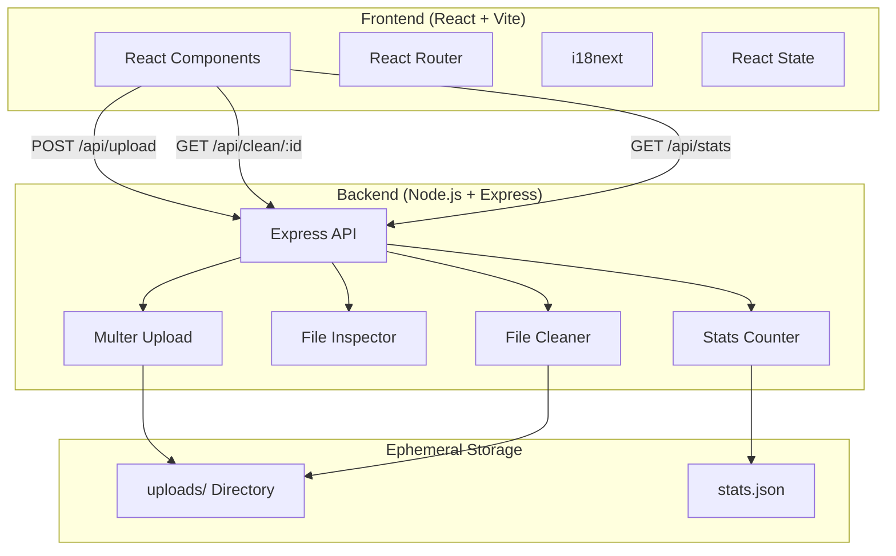

# System Patterns: Kürdan

## System Architecture



## Key Technical Decisions

### 1. Server-Side Processing
**Decision**: Process files on server rather than client-side.

**Rationale**:
- More powerful library support (Sharp, node-id3)
- Consistent behavior across browsers
- Better handling of large files
- More thorough metadata removal

### 2. Ephemeral File Storage
**Decision**: Store files temporarily in `server/uploads/` with UUID prefixes.

**Rationale**:
- Unique identification for concurrent uploads
- Easy cleanup after processing
- No database required
- Original filename preserved in ID

### 3. No User Authentication
**Decision**: Anonymous access without accounts.

**Rationale**:
- Aligns with privacy-first philosophy
- Simpler architecture
- No user data to protect
- Lower barrier to entry

### 4. Tailwind CSS v4
**Decision**: Use Tailwind CSS for styling.

**Rationale**:
- Rapid UI development
- Consistent design system
- Dark mode support built-in
- Small production bundle size

## Design System & Theming
### Color Palette
The application currently uses a specific color palette defined in Tailwind classes and some inline styles.

**Primary Color:** `Indigo` (Tailwind colors)
- Primary actions: `bg-indigo-600`
- Hove states: `bg-indigo-700`
- Accents/Glows: `indigo-400`, `indigo-500`

**Neutral Color:** `Slate` (Tailwind colors)
- Backgrounds: `bg-slate-50`, `dark:bg-slate-900`
- Text: `text-slate-800`, `text-slate-200`
- Borders: `border-slate-200`, `dark:border-slate-700`

### Hardcoded Colors (For Theme Migration)
Be aware of these specific inline styles when migrating themes:

1. **Global Stats Counter (`Home.jsx`)**:
   - Glow effect uses hardcoded `rgba(99, 102, 241, ...)` (Indigo-500 equivalent)
   - Text color uses `text-slate-50` / `dark:text-slate-900`

2. **Dropzone Glow (`Dropzone.jsx`)**:
   - Idle glow effect uses `shadow-[0_0_30px_-5px_rgba(99,102,241,0.2)]`

### Theme Migration Strategy
To change the color scheme (e.g., from Indigo to Emerald):
1. **Tailwind Config**: Update `primary` color alias in `tailwind.config.js` (if creating one) or search/replace `indigo-` classes.
2. **Inline Styles**: Manually update `rgba(...)` values in `Home.jsx` and `Dropzone.jsx` to match the new primary color's RGB values.
3. **Icons**: Check Lucide icon color classes (usually `text-indigo-600`).

### Custom Animations
Glow pulse animations are defined in `index.css` inside the `@theme` block:
- `animate-glow-pulse`: Text shadow pulse (used for Stats Counter)
- `animate-box-glow-pulse`: Box shadow pulse (used for Dropzone idle state)

## Design Patterns in Use

### Frontend Patterns

#### 1. Component Composition
```
App
├── Header (with ThemeToggle, LanguageToggle, SupportModal)
├── Routes
│   ├── Home
│   │   ├── Dropzone
│   │   ├── FileItem (multiple)
│   │   └── MetadataViewer
│   ├── Privacy
│   ├── Terms
│   ├── License
│   └── Contact
└── Footer
```

#### 2. State Management
- **Local state**: `useState` for component-level state
- **Callbacks**: `useCallback` for memoized handlers
- **Effects**: `useEffect` for keyboard shortcuts and cleanup

#### 3. Optimistic UI Updates
Files show "uploading" status immediately, updated to "pending" when server responds.

### Backend Patterns

#### 1. File Processing Pipeline
```
Upload → Store → Inspect → Return Metadata
                    ↓
Request Clean → Process by Type → Stream Download → Delete Files
```

#### 2. Type-Specific Handlers
```javascript
// Dispatcher pattern for file type handling
async function processFile(filePath, mimetype) {
    if (mimetype.startsWith('image/')) return cleanImage(buffer, mimetype);
    if (mimetype.startsWith('audio/')) return cleanAudio(filePath);
    if (mimetype === 'application/pdf') return cleanPDF(buffer);
    if (isOfficeFile(mimetype)) return cleanOfficeFile(buffer);
}
```

#### 3. Stats Counter (Privacy-Safe)
```javascript
// Only increment, no file info stored
function incrementCleanedCount() {
    const stats = loadStats();
    stats.totalCleaned++;
    stats.lastUpdated = new Date().toISOString();
    saveStats(stats);
    return stats.totalCleaned;
}
```

#### 4. Security Middleware Pipeline
```javascript
// Order matters: Trust proxy → HTTPS redirect → Helmet → CORS → Rate limit → Routes
if (BEHIND_PROXY) app.set('trust proxy', 1);
if (NODE_ENV === 'production') app.use(httpsRedirect);
app.use(helmet());
app.use(cors(corsOptions));
app.use('/api/', apiLimiter);
```

#### 5. Path Traversal Protection
```javascript
// Multi-layer protection pattern
const safeFileName = path.basename(fileId);         // Strip path components
const filePath = path.join(UPLOAD_DIR, safeFileName);
const resolvedPath = path.resolve(filePath);
if (!resolvedPath.startsWith(resolvedUploadDir + path.sep)) {
    return res.status(403).json({ error: 'Access denied' });
}
```

## Component Relationships

### Frontend Components

| Component | Responsibility | Dependencies |
|-----------|---------------|--------------|
| `App.jsx` | Root layout, routing, modals | All pages, Footer, ThemeToggle, LanguageToggle |
| `Home.jsx` | Main functionality page | Dropzone, FileItem, MetadataViewer |
| `Dropzone.jsx` | File upload UI | None |
| `FileItem.jsx` | Individual file display | None |
| `MetadataViewer.jsx` | Metadata display panel | None |
| `Footer.jsx` | Site footer links | None |
| `ThemeToggle.jsx` | Dark/light mode switcher | None |
| `LanguageToggle.jsx` | Language selector | i18next |
| `SupportModal.jsx` | Support/donation modal | None |

### Backend Functions

| Function | Responsibility | Called By |
|----------|---------------|-----------|
| `inspectFile()` | Extract metadata from file | `/api/upload` endpoint |
| `processFile()` | Route to appropriate cleaner | `/api/clean/:id` endpoint |
| `cleanImage()` | Remove image metadata via Sharp | `processFile()` |
| `cleanAudio()` | Remove audio tags via node-id3 | `processFile()` |
| `cleanPDF()` | Remove PDF metadata via pdf-lib | `processFile()` |
| `cleanOfficeFile()` | Remove Office metadata via JSZip | `processFile()` |

## Critical Implementation Paths

### 1. File Upload Path
```
User drops file → Dropzone.handleDrop() → Home.handleFilesAdded()
→ FormData POST to /api/upload → Multer saves file → inspectFile()
→ Response with metadata → UI updates file status
```

### 2. File Cleaning Path
```
User clicks "Remove Metadata" → Home.processAll()
→ GET /api/clean/:id → processFile() → type-specific cleaner
→ res.download() with cleaned file → cleanup temp files
→ UI updates to "done" status
```

### 3. Download Path
```
User clicks "Download All" → Home.downloadAll()
→ If single file: saveAs(blob, filename)
→ If multiple: JSZip creates archive → saveAs(zip, "cleaned_files.zip")
```

## Error Handling Patterns

### Frontend
- Upload failures set file status to `error`
- Processing failures show appropriate error message
- Network errors caught and displayed gracefully

### Backend
- Missing file returns 404
- Processing errors return 500 with generic message
- File cleanup happens even on errors (in download callback)
